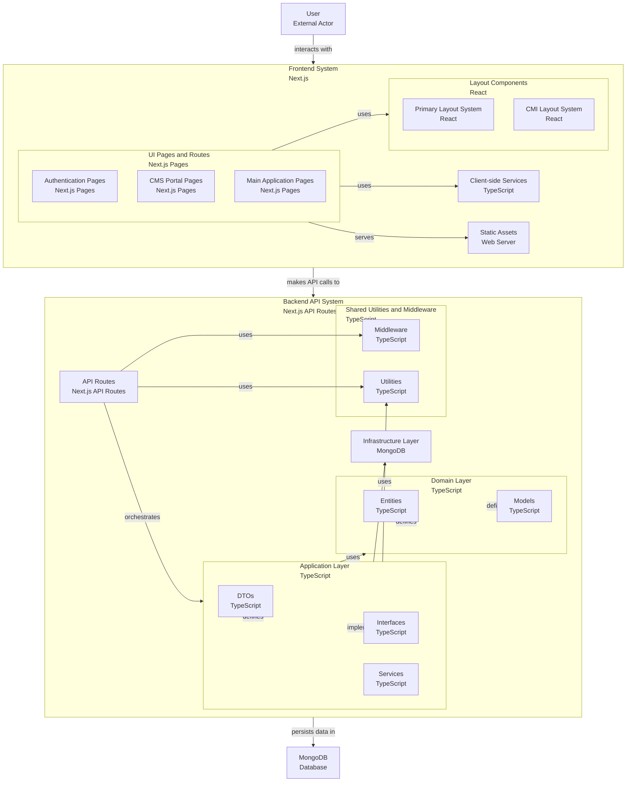

<p align="center">
  
</p>
<br/>

<p align="center">
  <a href="#overview">Overview</a> •
  <a href="#getting-started">Getting Started</a> •
  <a href="#technology">Technology</a> •
  <a href="#project-architecture-diagram">Project architecture diagram</a> 
  <br/>
</p>

---

# CMIWL PORTAL WEB

## Overview

"CMIWL" It is a ...

## Getting Started

First, run the development server:

```bash
npm i --legacy-peer-deps
```

```bash
npm run dev
```
or run with build
```bash
npm run build:start
```

> [!NOTE]
> Open [http://localhost:3000](http://localhost:3000) with your browser to see the main website result.

> [!NOTE]
> Open [http://localhost:3000/pw0wl](http://localhost:3000/pw0wl) with your browser to see the CMS result.

---

First, run test with jest:

```bash
npm run test
```
or
```bash
npm run test:watch
```
```bash
npm run test:cov
```
> [!NOTE]
> If failed. Try to `npm run build` then try again.

---

First, run load test with k6:\
Load test types: `Smoke`, `Average`, `Stress`, `Soak`, `Spike`, `Breakpoint`\
on tests/k6, replace url for test

eg.

```bash
k6 run smoke.js
```
> [!IMPORTANT]
> Makesure you have k6 installed.\
> [Learn more about k6](https://grafana.com/docs/k6/latest/get-started/running-k6/)

## Technology

#### Next.js 14
#### MongoDB Atlas
#### Custom theme, CSS for main website
#### PrimeTek PrimeReact, SakaiReact for CMS

## Learn More

To learn more about, take a look at the following resources:

-   [Next.js Documentation](https://nextjs.org/docs)
-   [Learn Next.js](https://nextjs.org/learn)
-   [MongoDB Atlas](https://www.mongodb.com/)
-   [PrimeReact](https://primereact.org/)
-   [SakaiReact](https://sakai.primereact.org/)

---

## Project architecture diagram



